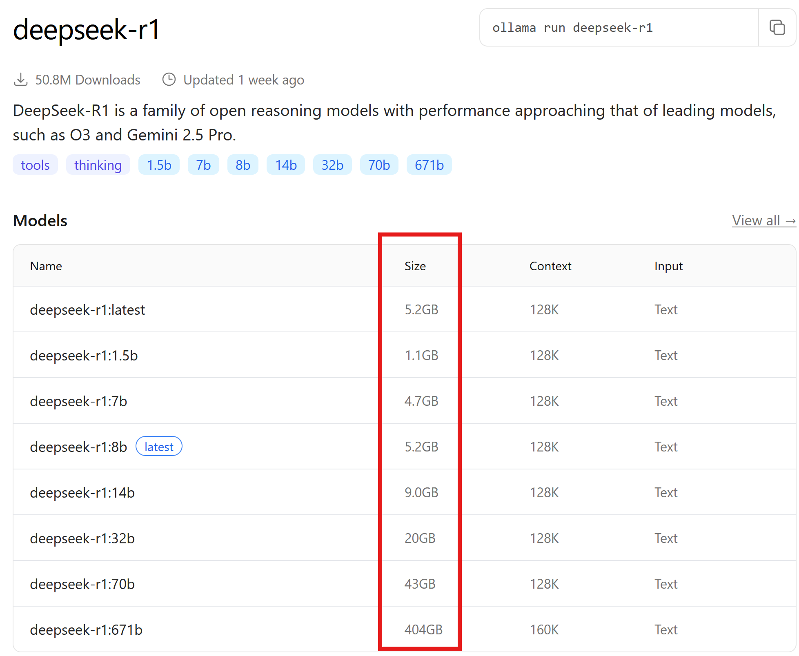
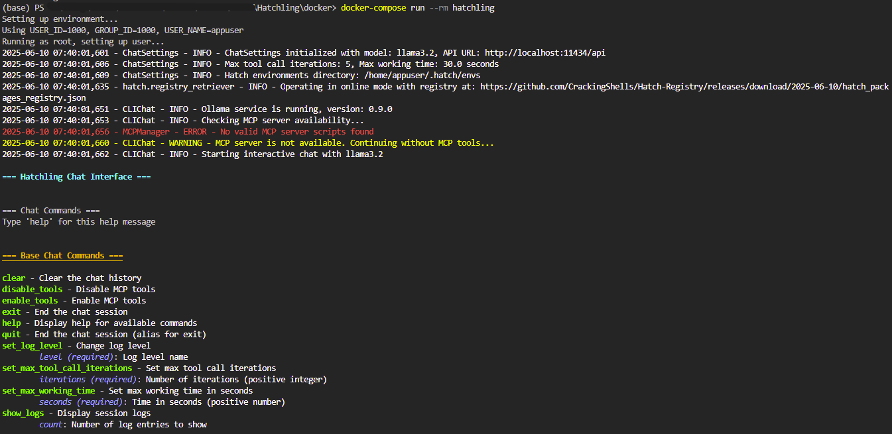

# Running Hatchling

This section assumes you have followed the [docker setup](./docker-setup.md).

In this guide, you will:

1. Start Ollama to have access to local LLMs later in Hatchling.
2. Download, setup, and start Hatchling

## Running Ollama with Docker

### Using CPU or GPU for the LLM

* Windows/Linux **CPU only** & MacOS **on Apple Silicon**:

  ```bash
  docker run -d -v ollama:/root/.ollama -p 11434:11434 --name   ollama ollama/ollama
  ```

* Windows/Linux **NVIDIA GPU support**:

  ```bash
  docker run -d --gpus=all -v ollama:/root/.ollama -p 11434:11434 --name ollama ollama/ollama
  ```

* Windows/Linux **AMD GPU support**:

  ```bash
  docker run -d --device /dev/kfd --device /dev/dri -v ollama:/  root/.ollama -p 11434:11434 --name ollama ollama/ollama:rocm
  ```

### Checking that GPU support is enabled  as expected

* Go to the `Containers` tab in Docker Desktop (arrow 1) and select your Ollama container

  * Check the logs and search for a message indicating GPU detection, similar to:

    ```txt
    msg="inference compute" id=GPU-a826c853-a49e-a55d-da4d-804bfe10cdcf  library=cuda variant=v12 compute=8.6 driver=12.7 name="NVIDIA GeForce RTX 3070 Laptop GPU" total="8.0 GiB" available="7.0 GiB"
    ```

    
* Alternatively, run the command `docker logs ollama` and search for the message in the output.

For more detailed instructions and options, refer to the [official Ollama Docker documentation](https://github.com/ollama/ollama/blob/main/docs/docker.md).

## Running Hatchling with Docker

### Get the source code

At this step, you will be downloading the content of Hatchling. Currently, we are only using GitHub's interface to install Hatchling.

* Open a terminal
* Navigate to a directory where you want Hatchling to be:

  ```bash
  cd path/to/the/directory/you/want
  ```

* Then, use Git, to retrieve the source code

  ```bash
  git clone https://github.com/CrackingShells/Hatchling.git
  ```

### Navigate to the `docker` directory of Hatchling

```bash
cd ./Hatchling/docker
```

### Install Hatchling by building the code

   ```bash
   docker-compose build hatchling
   ```

   This typically takes 20 to 50 seconds depending on your computer.

### Start Hatchling

#### Configure Hatchling's Environment

Modify the variables in the `.env` file to suit your needs.

#### Configuration

Configuration is managed through environment variables or a `.env` file in the `docker` directory:

| Variable | Description | Default |
|----------|-------------|---------|
| `OLLAMA_HOST_API` | URL for the Ollama API | `http://localhost:11434/api` |
| `OLLAMA_MODEL` | Default LLM model to use | `llama3.2` |
| `HATCH_HOST_CACHE_DIR` | Directory where Hatch environments and cache will be stored on the host machine | `./.hatch` |
| `HATCH_LOCAL_PACKAGE_DIR` | Directory where local packages are stored on the host machine to be accessible in the container | `../../Hatch_Pkg_Dev` |
| `NETWORK_MODE` | Docker network mode | `host` (for Linux) |
| `LOG_LEVEL` | The default log level at start up | `INFO` |
| `USER_ID` | User ID for the container user (set on Linux to match host user for permissions) | `1000` |
| `GROUP_ID` | Group ID for the container user (set on Linux to match host group for permissions) | `1000` |
| `USER_NAME` | Username for the container user (optional, defaults to `appuser`) | `appuser` |

##### OLLAMA_HOST_API

You may need to adjust `OLLAMA_HOST_API` to match where your Ollama container is hosted. If you did not change this value and used the default from [earlier](#using-cpu-or-gpu-for-the-llm), then you don't need to change that variable either.

##### OLLAMA_MODEL

For hatchlings, one can change `OLLAMA_MODEL` to any model under the category [tools](https://ollama.com/search?c=tools)

> [!Warning]
> Be mindful of the size of the LLM. Models larger than your GPU's memory (VRAM on GPU cards, or the partition of the shared memory that can be allocated to GPU tasks on Apple Silicon), will not run smoothly. You can check the actual size of a model when selecting a model on the within [the list](https://ollama.com/search?c=tools)



For example, [earlier](#checking-that-gpu-support-is-enabled--as-expected) the GPU's available memory was indicated to be 7GB. Therefore, this GPU can load up to `deepseek-r1:8b`, which happens to be the default (marked as `latest`).

#### Ollama

* On Docker Desktop, navigate to your containers (arrow 1), and press the play button (arrow 2)

* Alternatively, run the command `docker start ollama`

#### Hatchling

> [!Note]
> You can adapt the [environment variables](#configuration) to suit your needs (e.g. change the LLM) before you run the following command:

```bash
# From the docker directory in your project
docker-compose run --rm hatchling #The `--rm` flag ensures the container is removed when you exit the application.
```

If Hatchling successfully connects to Ollama, it will download the specified LLM model. This will materialize by many prints indicating the download progress. Of course, the download time varies based on the model's size: the default model `llama3.2` takes about 2GB.

Here is a screenshot of what Hatchling typically looks like right after start up:



You can receive help about all available commands by writing `help` in the chat. Details about the commands are also available in the [documentation](./chat_commands.md)